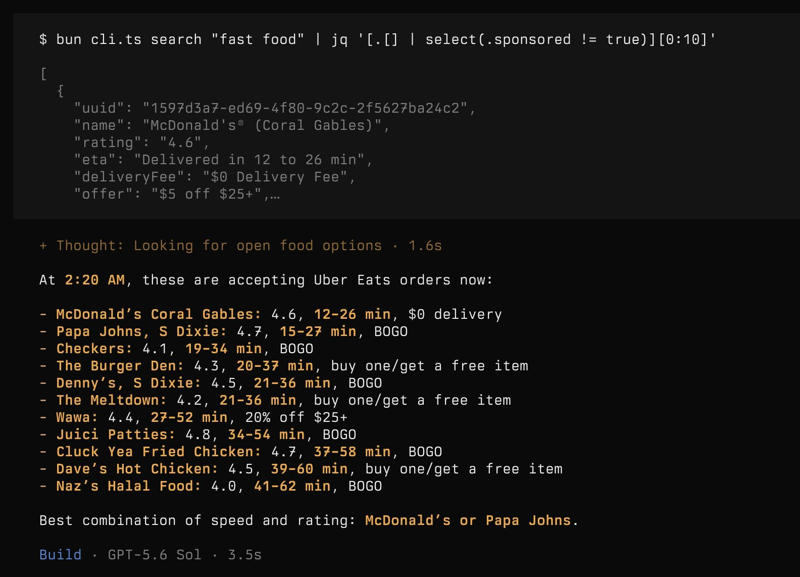

https://x.com/thdxr/status/2078727284865827140

dax

@thdxr
used a trick 
@jlongster
 came up with

agents can control browsers but you can also ask it to record network requests into a HAR file

then it can derive a client for any website which is more efficient than browser controlling it every time

made it build a quick uber eats cli

